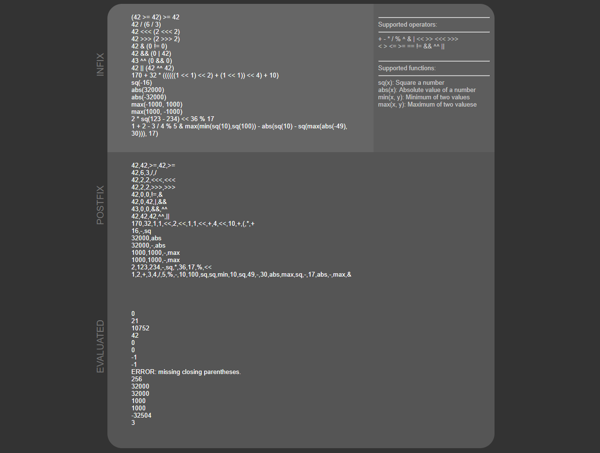

# Expression Evaluator
This application uses the shunting yard algorithm to convery expressions from infix notation, to postfix notation (reverse polish notation). It will then evaluate the expression and return the result.

### Usage
Each line represents a new expression, allowing this application to be used for multitasking.

#### This application is hosted at http://simewu.com/expression-evaluator
